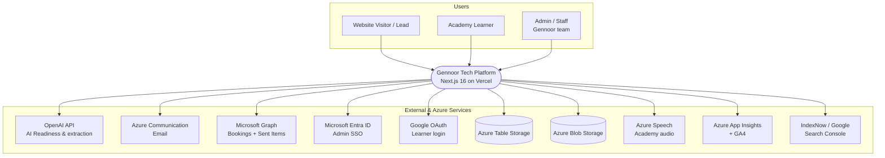
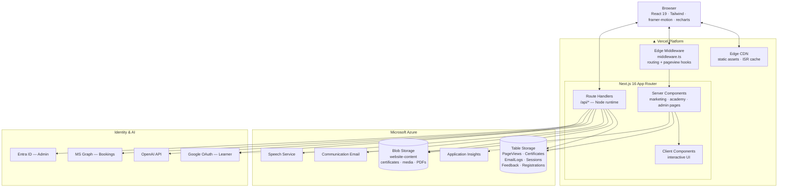
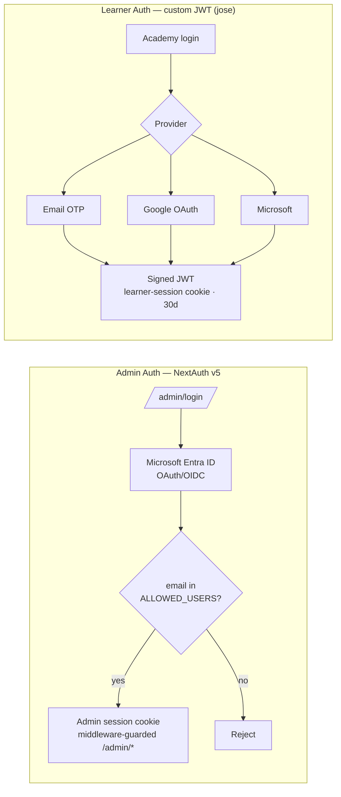
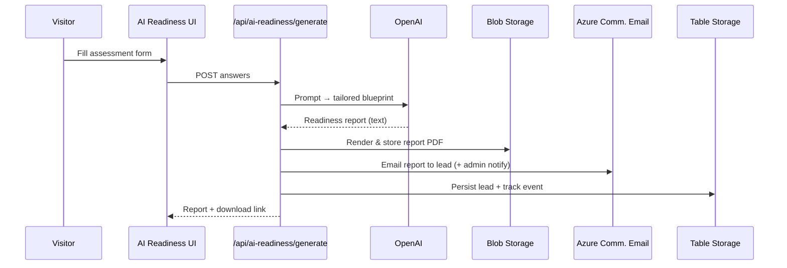
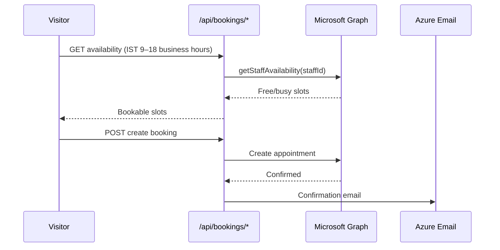
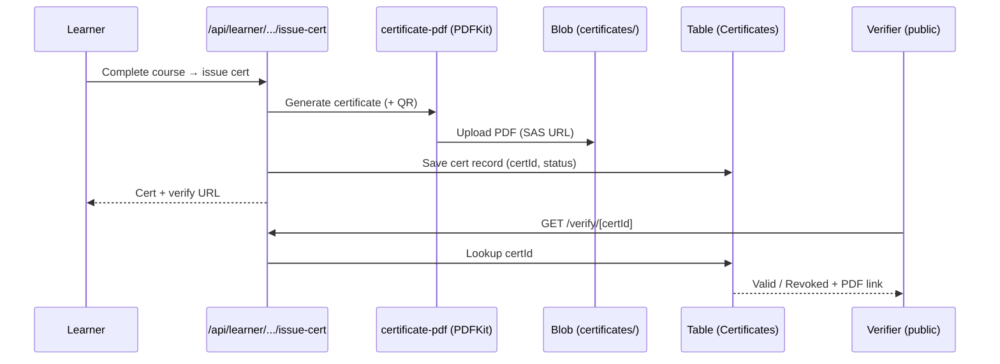
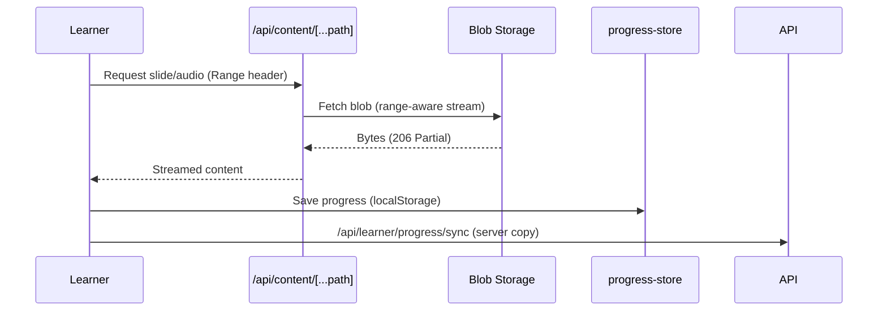
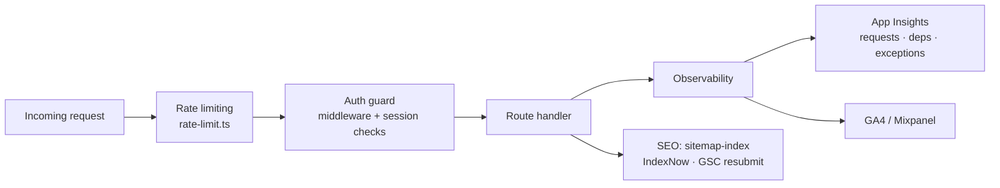
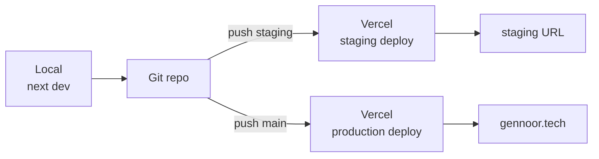

# Gennoor Tech — End-to-End Architecture

> Enterprise AI Training & Solutions platform.
> **Stack:** Next.js 16 (App Router) · React 19 · TypeScript · Tailwind · deployed on **Vercel**, backed by **Microsoft Azure** services.
> _Last generated: 2026-06-18_

---

## 1. System Context (C4 Level 1)

How the platform sits between its users and the external services it depends on.



---

## 2. Container / Deployment Architecture (C4 Level 2)

The runtime shape: one Next.js app, split into Edge + Node runtimes, fronted by Vercel's CDN.



---

## 3. Application Layers

```
┌──────────────────────────────────────────────────────────────────────┐
│  PRESENTATION  ── src/app/**  (App Router pages)                       │
│  Marketing (services, industries, solutions, about, resources/blog)   │
│  Academy / ai-academy (courses, dashboard, player)                    │
│  Admin console (/admin/*)  ·  Verify (/verify/[certId])               │
│  Components: src/components/{home,academy,portal,booking,ui,...}      │
├──────────────────────────────────────────────────────────────────────┤
│  API / ROUTE HANDLERS  ── src/app/api/**  (Node runtime)              │
│  auth · learner · admin · ai-readiness(+v2) · bookings · certificates │
│  blog-comments · *-enquiry · send-otp/verify-otp · content/media proxy│
├──────────────────────────────────────────────────────────────────────┤
│  DOMAIN / SERVICES  ── src/lib/**                                     │
│  auth.ts · learner-auth.ts · admin-auth.ts   (identity)              │
│  azure-storage.ts · azure-blobs.ts           (persistence)          │
│  email-service.ts · microsoft-graph.ts       (comms + bookings)     │
│  certificates.ts · certificate-pdf.ts        (credentials)          │
│  progress-store.ts · course-feedback.ts      (learning)             │
│  analytics.ts · app-insights.ts · rate-limit.ts (cross-cutting)     │
├──────────────────────────────────────────────────────────────────────┤
│  DATA / CONTENT  ── src/data/**  ·  src/config/**                    │
│  Static course content, blog posts, authors, course catalog (in-repo)│
└──────────────────────────────────────────────────────────────────────┘
```

---

## 4. Identity Model — two separate auth systems



- **Admin** → `next-auth@5` + Microsoft Entra ID, restricted to an allow-list (`AZURE_AD_ALLOWED_USERS`), enforced by `middleware.ts` on `/admin/*`.
- **Learner** → self-issued HS256 JWT in an httpOnly cookie (`src/lib/learner-auth.ts`); three login paths: **OTP** (email code), **Google**, **Microsoft**.

---

## 5. Key End-to-End Flows

### 5a. AI Readiness Assessment (lead-gen + GenAI)



### 5b. Booking an Expert Call (Microsoft Graph Bookings)



### 5c. Certificate Issue + Public Verification



### 5d. Academy Content & Audio Streaming



---

## 6. Data Stores

| Store | Technology | What lives here |
|-------|-----------|-----------------|
| **Tabular** | Azure **Table Storage** | PageViews, Certificates, EmailLogs, Sessions, AI-Readiness leads, Course feedback, Cowork registrations, Blog comments |
| **Objects** | Azure **Blob Storage** (`website-content` + others) | Certificate PDFs, generated report PDFs, academy media/audio, uploaded content |
| **Static content** | In-repo `src/data/**`, `src/config/**` | Course chapters, blog posts, authors, catalog — shipped with the build |
| **Client state** | Browser `localStorage` | Learner course progress (synced to server) |
| **Ephemeral** | OTP store (`otp-store.ts`) | Short-lived email OTP codes |

---

## 7. Cross-Cutting Concerns



- **Security:** httpOnly cookies, JWT signing (`jose`), Entra allow-list, per-route rate limiting, server-side env secrets, SAS-scoped blob access.
- **Observability:** Azure Application Insights (auto-collect requests/deps/exceptions) + GA4 + optional Mixpanel; custom PageViews table.
- **SEO automation:** `sitemap-index`, IndexNow push, Google Search Console resubmit (`scripts/*`, `npm run indexnow`).
- **Email routing:** role-based from-addresses (sales/training/support/...) via Azure Communication Email, mirrored to Outlook Sent Items through MS Graph.

---

## 8. Deployment & Environments



- **Vercel** auto-deploys both `main` (prod) and `staging` branches (`vercel.json`).
- Secrets via Vercel env vars (`.env.example` documents the full surface: Azure conn strings, OpenAI, Graph, Entra, SMTP fallbacks, CRM/WhatsApp toggles).
- Build: `next build`; ISR/edge handled by Vercel; Node runtime for `/api/*`.

---

## 9. Architecture at a glance

| Concern | Choice |
|---|---|
| Framework | Next.js 16 App Router, React 19, TypeScript |
| Hosting | Vercel (Edge CDN + serverless functions) |
| Styling | Tailwind, framer-motion, lucide-react, recharts |
| Admin identity | NextAuth v5 + Microsoft Entra ID (allow-list) |
| Learner identity | Custom JWT (jose) — OTP / Google / Microsoft |
| Persistence | Azure Table Storage + Azure Blob Storage |
| GenAI | OpenAI API (readiness blueprints, field extraction) |
| Comms | Azure Communication Email + MS Graph |
| Scheduling | Microsoft Graph Bookings |
| Credentials | PDFKit certificates + QR + public verify |
| Observability | App Insights + GA4 (+ Mixpanel optional) |
| Growth/SEO | sitemap-index, IndexNow, GSC resubmit |
```
