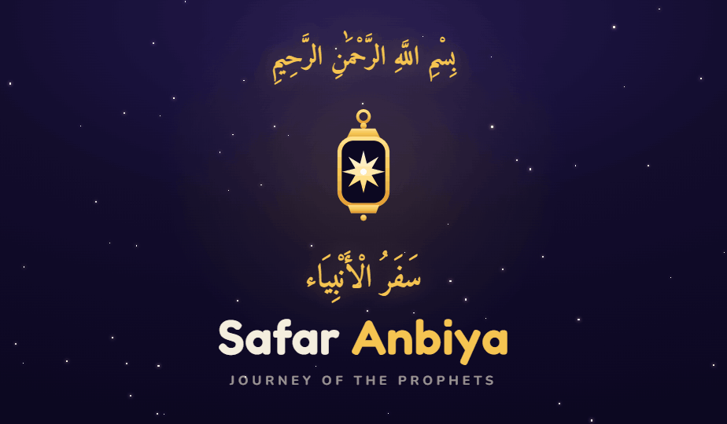

# Safar Anbiya · Journey of the Prophets

> A gamified Islamic learning journey for kids — travel the path of all **25 prophets** by the light of your lantern.



A cinematic, story-driven Progressive Web App that turns the lives of the prophets
into an interactive adventure: each prophet has their own night sky, animated story
panels, a moral decision, the Qur'anic verse that anchors the lesson, a quiz, and a
reward — wrapped in a Noor (light) gamification ladder of levels, stars, badges and
daily streaks.

**Live:** `safar-anbiya.gennoor.com` · **Platforms:** Web (PWA, installable) · Android / iOS via PWABuilder

---

## 🎯 Purpose & Objective

| | |
|---|---|
| **The problem** | Religious education for children is usually static — text to read or videos to watch passively. Kids disengage. |
| **The objective** | Make learning the stories of the 25 prophets *active, beautiful and rewarding* — something a 5–10 year old chooses to open, the way they open a game. |
| **The approach** | Each prophet becomes a **level**. Story → choice → consequence → the actual Qur'anic ayah → quiz → reward. Progress, stars and streaks give kids a reason to come back daily. |
| **Who it's for** | Muslim families and children; parent-managed accounts with child profiles. |

---

## ✨ What it does

- **25 prophets, 25 journeys.** Each prophet gets a distinct night sky — its own colour palette, aurora wash and moon placement — so every stage *feels* different.
- **Cinematic storytelling.** Continuous Ken Burns drift plus per-scene cross-fades render each story beat like a moving illustration.
- **Bilingual narration.** Pre-generated **Azure Neural** voices in **English** and **Urdu** (male & female), with live word-by-word highlighting synced to the audio.
- **The real ayah.** Every prophet surfaces 3–4 authentic Qur'anic verses (text + recitation + meaning) fetched from verified sources, with a qari recitation and spoken meaning.
- **Gamification (Noor).** A level ladder, 1–3 star ratings per prophet, a badge gallery, a 🔥 daily streak, a recap quiz, confetti and WebAudio chime SFX.
- **Installable PWA.** Offline-capable, full app manifest, home-screen install, app shortcuts, Edge side-panel docking.
- **Accounts & profiles.** Parent-managed accounts, OTP auth, child profiles with a generated Ghibli-style avatar, server-side progress.

---

## 🧭 The journey — stage flow

Every prophet is played as a sequence of **9 beats**:

```
profile select → journey map
                     │
                     ▼
   arrive → story → decision → dres → modern → mres → ayah → quiz → reward
   (sky)   (panels) (choice)  (result) (today) (result) (verse) (test) (stars + confetti)
```

| Beat | What happens |
|------|--------------|
| **arrive** | The prophet's unique sky fades in; lantern lights the path |
| **story** | Animated, narrated story panels (Ken Burns + fade) |
| **decision** | The child makes a moral choice |
| **dres** | The consequence of that choice is shown |
| **modern** | A "what would you do today?" parallel |
| **mres** | The modern-day result |
| **ayah** | 3–4 authentic Qur'anic verses — recitation + meaning |
| **quiz** | A short recap quiz |
| **reward** | Stars, Noor, badges, streak, confetti 🎉 |

---

## 🏗️ Architecture

```
┌──────────────────────────────────────────────────────────────┐
│  Next.js (App Router) · React 19 · installable PWA           │
│  One client component: app/components/ProphetsJourney.jsx     │
│  Content: prophets-data.js (EN) · prophets-ur.js (Roman-Urdu) │
│           prophets-ayah.js (Qur'an) · localStorage progress   │
└───────────────┬──────────────────────────────────────────────┘
                │ deployed to
┌───────────────▼──────────────────────────────────────────────┐
│  Azure Web App (B1) · Node 22 · GitHub Actions CI/CD          │
│  Swappable service layer (SERVICE_MODE = local | azure):      │
│    db → Azure SQL    storage → Blob    email/OTP → ACS         │
│    avatars → gpt-image-2   narration → Azure Speech (neural)   │
└──────────────────────────────────────────────────────────────┘
```

**Narration pipeline.** Narration is *pre-generated* static audio, not live TTS:
`scripts/generate-audio.mjs` calls Azure Speech and writes `public/audio/<hash>.mp3` +
a manifest. A content hash matches each clip to its story beat, so audio loads instantly
and works offline.

---

## 🛠️ Tech stack

| Layer | Technology |
|------|------------|
| **Frontend** | Next.js 15 (App Router), React 19, hand-rolled CSS animations |
| **Hosting** | Azure Web App B1 (Node 22) |
| **Database** | Azure SQL |
| **Media / storage** | Azure Blob Storage |
| **Auth / email** | Azure Communication Services (OTP) |
| **Voice (TTS)** | Azure Speech — `en-US-JennyNeural`, `ur-PK-AsadNeural`, `ur-PK-UzmaNeural` |
| **Avatars** | gpt-image-2 |
| **Qur'an data** | alquran.cloud (quran-uthmani, en.sahih, ur.junagarhi, ar.alafasy) |
| **CI/CD** | GitHub Actions → Azure (publish-profile) |
| **Packaging** | PWABuilder (Android / iOS / Windows) |

---

## 🎨 Brand

**Twilight navy & gold.** The guiding lantern + eight-pointed star (Noor).

| Token | Hex |
|------|-----|
| Twilight | `#0C0820` |
| Royal | `#1A1140` |
| Noor Gold | `#F5C451` |
| Amber | `#F0A93A` |
| Cream | `#F4EEDE` |
| Emerald | `#2E9E6B` |

**Fonts:** Display **Fredoka** · Arabic **Amiri** · Body **Nunito**

---

## 🔍 A look at the code

The whole UI is styled with inline CSS strings parsed by a tiny `s()` helper —
it turns `"border-radius:30px;color:#f4eede"` into a React style object, keeping
hundreds of one-off scene styles readable inline:

```js
function s(str) {
  const o = {};
  if (!str) return o;
  str.split(";").forEach((decl) => {
    const i = decl.indexOf(":");
    if (i < 0) return;
    const prop = decl.slice(0, i).trim();
    const val = decl.slice(i + 1).trim();
    if (!prop || !val) return;
    const key = prop.replace(/-([a-z])/g, (_, c) => c.toUpperCase());
    o[key] = val;
  });
  return o;
}
```

---

## 📦 This showcase folder

```
showcase/
├── README.md          ← this file (drop into any repo / docs site)
├── index.html         ← self-contained animated product page (open in a browser)
└── assets/
    ├── social-lockup.png      brand banner
    ├── screenshot-phone.png   in-app splash
    ├── emblem.png / .svg       lantern emblem
    ├── icon.png                app icon
    └── beats/                  REAL screenshots of every journey beat
        ├── 01-after-begin.png  welcome
        ├── 03-map.png          journey map (all 25 prophets)
        ├── beat1-arrive.png … beat8b-reward-clean.png  the 9-beat flow
```

The `beats/` images are genuine screenshots captured from the running app
(prophet **Adam (AS)**, English), so the workflow on the product page shows the
real experience — not mockups.

`index.html` is fully self-contained — no build step, no dependencies. Open it
directly, or embed it as the product page on another site.

---

*Built with care. © Safar Anbiya · gennoor.com*
